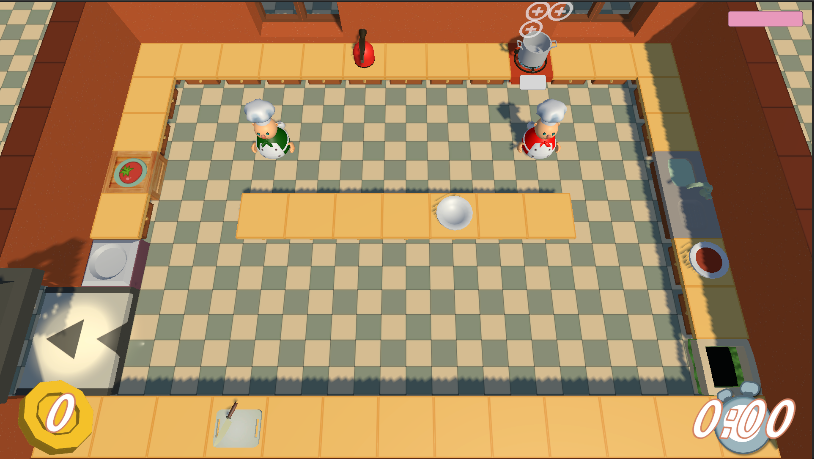
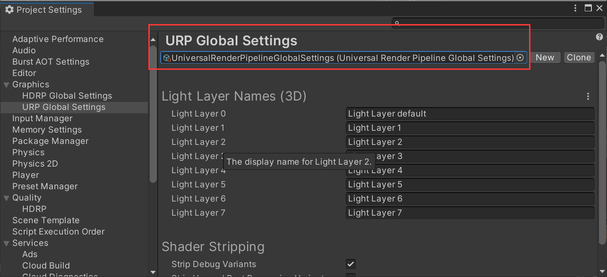
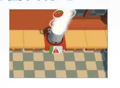

<b>OurCooked

[TOC]

# 1.0 项目简介

OurCooked 是基于游戏 OverCooked 的 PC 端改编游戏，含部分改编的游戏内容。

游戏的大部分资源(如墙体、桌子、材料、人物等)来自[Undercooked](https://github.com/daltonbr/Undercooked)，部分资源(如餐厅订单、游戏开始界面、游戏菜单界面等)独自完成。

OurCooked 定位为情侣游戏，游戏中有明显的情侣元素。游戏内容分为3关，分别为 

- Origin 初始关卡，为复原 OverCooked 游戏设计，致敬经典。时间减为 0 时候游戏结束。
- Lover 情侣关卡，在 Origin 关的基础上增加难度，添加情侣的拥抱内容。玩家有几率速度减缓为0，需要拥抱才能恢复速度。两个 Player 速度变为 0 时候游戏结束。游戏虽然是得分的过程，也要考虑到伴侣的感受，需要陪伴。
- Family 家庭关卡，在 Lover 关的基础上再加难度，增加一个小孩的模块，游戏背景建立在家庭层面。小孩有几率 cry 发出噪音，需要拥抱才能让小孩停止 cry不仅要考虑得分和伴侣感受，同时也要照顾到小孩，平衡家庭与事业。

# 2.0 游戏创意

OverCooked 又称为胡闹厨房、情侣厨房、分手厨房，但是原游戏中其实并无特殊的情侣元素，所以本项目 OurCooked 在 OverCooked 基础上添加了情侣元素。

游戏内容分为3关，分别是 Origin 初始关卡、Lover 情侣关卡、Family 家庭关卡。

## 2.1 Origin 

初始关卡，为复原 OverCooked 游戏设计，致敬经典

此为游戏开始界面，回车键 Enter 被按下后，进入游戏菜单页面

按ESC界面，退出菜单界面，游戏开始

左上角会不断随机生成餐厅的订单(最多四个)，

左下角为整局游戏的得分，

右下角为游戏剩余时间，每局游戏有 3 minutes，当时间减为 0 时候，游戏结束

两个玩家通过上下左右移动，拿原材料 -> 切菜 -> 放到锅炉里面烹煮 -> 用干净的盘子承接 -> 交到传送带处 -> 得分 -> 洗脏盘子 -> 拿原材料 -> ...

循环往复，满足餐厅订单，获得加分，最后 3 分钟时间到了后游戏结束。

## 2.2 Lover

情侣关卡，在 Origin 关的基础上增加难度，添加情侣的拥抱内容

游戏过程中，Player1 和 Player2 会随机性地进入 hopeHug 阶段，速度开始减慢，直至变为0。

如果两个角色的速度都变为 0 ，那么游戏结束。

两个角色可以通过拥抱(角色接触在一起)，然后通过按键 ctrl，触发角色的拥抱功能，等待右上角粉色的进度条 loverSlider 从 0 变成 1 后，两个角色的速度会恢复如初。

**游戏设计为进入 hopeHug 的过程并没有任何提示，玩家只能通过 Player 的速度减慢察觉出来。这就类似于情侣之间，可能因为一些小事导致一方不愉快，需要对方从行为中细心察觉到，越早察觉就可以越快通过拥抱解决问题，恢复双方的效率。**

## 2.3 Family

家庭关卡，在 Lover 关的基础上再加难度，增加一个小孩的模块，游戏背景建立在家庭层面

>  两个角色仍然会有几率进入 hopeHug 阶段，同 Lover 关卡。

最下方的小孩，有几率会进入哭闹 cry 状态，粉色进度条会从 1 减为 0，之后触发噪音音效，等到玩家通过接触小孩，并且按键 ctrl 进行拥抱，等待进度条加载到一半后，噪声音效会被关闭。

**游戏设计为，小孩的吵闹是随机的，如果玩家只顾得分，不顾小孩的吵闹，那么触发的噪声会很影响游戏体验，影响心情。**

# 3.0 游戏各模块介绍

### 3.0.1 材质的 Shader

因为本项目中所使用的 Assets 中的 Material 都使用了 URP 渲染管线

本项目的全局渲染管线使用了 URP(如果还保持 Standard 模式，所有材质将会变成粉红色，无法正常渲染)

 ## 3.1 Origin 初始还原关

### 3.1.1 InitialPannel 开始界面

有三行字

- OurCooked，表示游戏名称
- Press START play，表示按键开始游戏

### 3.1.2 GameOverPannel 游戏结束面板

- Score 本局游戏得分，当分数大于30时候亮一颗星，50分时候两颗，70分三颗

- Restart 重新开始游戏

- Exit 游戏退出按钮

### 3.1.3 ESCMenu 游戏菜单

左边四个按钮，分别是

- Rules 展示规则

  ESC 按键为打开或者关闭游戏菜单页面，被按下时候游戏被暂停

  OurCooked 为双人游戏，有两个人物角色 Player1、Player2

  Player1：

  - WSAD：上下左右方向键
  - 左 ctrl 键：切菜、洗盘子、拥抱
  - 左 shift 键：拿东西、放东西

  Player2：

  - Up/ Down/ Left/ Right：上下左右方向键
  - 右 ctrl 键：切菜、洗盘子、拥抱
  - 右 shift 键：拿东西、放东西

- Origin、Lover、Familey 关卡的跳转入口

  

- 游戏退出 Exit 按钮

### 3.1.4 Score 得分面板

- 进度条减为0之前提交 **+42** 分

- 没有及时提交则 **-30** 分

### 3.1.5 Time 时间面板

时间减为0时候游戏结束

### 3.1.6 Order 订单

左上角为餐厅订单，每个订单分为：

- 时间进度条：
  - 从1开始降为0，当变成0时候，订单会被取消，分数 -31
  - 在将为0之前，提交菜品到传送带(左下角)上，会加分 +41
- 菜品图片
- 原材料图片：此处表示需要三个西红柿
- 烹饪方式：此处表示需要锅煮（原 OverCooked 还有平底锅煎，本项目未实现）

### 3.1.7 Player 人物角色

人物分为绿色衣服的 Player1，橙色衣服的 Player2

两个人物都可以分别控制两个按键

- ctr 用于切菜/洗盘子/拥抱
- shift 用于拿/放东西

每个角色有 animator 动画效果

- isCleaning，true时角色进入擦盘子动画效果
- hasPickup，true 时角色变成双手拿物体的动画效果
- isChopping，true时角色开始切菜动画效果

### 3.1.8 ChopBoard 砧板

上面两种状态

- 有东西 tomato/tomato_chopped
- 没东西

有一个进度条 chopSlider，当 Player 进行切菜时候打开进度条 slider.value++，非切菜状态关闭进度条，不渲染进游戏场景。

### 3.1.9 Sink 水池 

水池中可以有很多盘子堆叠在一起，不管是脏的，还是干净的，但是 player 对于盘子的处理只能是一个个处理。

- 脏盘子

  脏盘子会被放进积水区(sink左边)

  按键 ctr 被按下时候，洗盘子

- 拿盘子

  干净盘子放在洗碗槽右边
  
  按键 shift 被按下时候，拿盘子

### 3.1.10 Deliver传送带

传送带会一直展示传送的特效（除非游戏暂停）

玩家端着盛了食物的盘子过来，会吸收掉盘子

销毁左上角最近的订单

全局得分+41

显示粒子特效

之后 2s 会在旁边的脏碗处 dishTray 生成一个脏盘子

### 3.1.11 Trash 垃圾桶

检测 player 手里的东西，然后分别处理

- tomato/tomato_chopped：直接丢掉
- cookingpot_food / cookingpot_burnedFood ：把锅里面的东西倒掉

### 3.1.12 Plate 盘子

- 盛满了食物的状态

  

- 干净状态

  

- 脏了状态

  

### 3.1.13 Hob火炉

- 火炉的火焰是动态效果，由 Shader 制作而成

#### 3.1.13.1 CookingPot锅

- **PlusIcon** 三个加号标志：表示目前锅里面煮了多少原材料

- **CheckOut** **煮好标志**：用于提示玩家煮好了

  

- **WarnIcon** **闪烁的警告标志**

  

  用于提示玩家需要

  - 或者继续添加食材

  - 或者把锅远离炉子

  - 或者将锅中的食物取走

- **锅中食物煮熟后**

  - 或者用干净盘子触碰锅，取走食物
  - 或者直接把锅端走，把食物倒到盘子内

### 3.1.14 CounterTop 普通桌子

- HighLight = true 时候桌子会变成高亮

- RimPower 数值可以体现高亮的程度

### 3.1.15 IngredientCreate 食材箱子

当 Animator.Open = true 时候箱子盖子会被打开

### 3.1.16 特效

#### 3.1.16.1 Steam蒸汽特效

锅中开始烹煮食物产生

#### 3.1.16.2  **Smoke** **浓烟特效**

锅中食物烧焦(警告标志消失)后产生

#### 3.1.16.3 **StarParticle** **星星特效**

提交食物到传送带上产生

#### 3.1.16.4 **WalkParticle** **移动特效** 

Player 移动产生 

#### 3.1.16.5 CounterTop **桌子高亮特效**

人物与静态物体(桌子、锅炉、传送带等)接触产生 

### 3.1.17 动画

#### 3.1.17.1 **Move** **移动动画**

Player 移动时候姿态会发生改变

#### **3.1.17.2 OpenIngredient** **打开食材箱子动画**

Player 打开箱子，箱子盖子会发生改变

#### **3.1.17.3 Chop** **切食材动画**

Player 切食材时候姿态会发生改变

#### 3.1.17.4 Clean **洗盘子动画**

Player 洗盘子时候姿态会发生改变

### 3.1.18 音效

- Background 背景音乐

- Buzzer 警告

- Chop 切菜

- ItemPick 拾取

- Pop 放下

- Notification 生成订单

- Success 订单提交

### 3.1.19 环境搭建

静态物体包括有

- 地板

- 墙体

- 普通桌子

  桌子本身的 collider.is Trigger = true

  所以对一上、下、左、右、中方位的桌子赋予了整体的 collider，防止 Player 穿模

- 放了小孩的桌子

## 3.2 Lover 情侣关

Player1 和 Player2 都随机降低速度为 0 ，需要拥抱，触发 loveSlider 加载满了后才能把速度恢复到初始状态，如果两个角色的速度都变成 0 ，游戏直接结束

## 3.3 Family 家庭关

最下方的小孩，有几率会进入哭闹 cry 状态，粉色进度条会从 1 减为 0，之后触发噪音音效，等到玩家通过接触小孩，并且按键 ctrl 进行拥抱，等待进度条加载到一半后，噪声音效会被关闭

# 4.0 核心编程模块 (仅介绍核心的代码内容)

 ## 4.1 Player 

按键是否按下在 Update() 函数内检测，提高按键灵敏度，用变量保存下被按下的值，在其他函数内进行判断使用

模块核心在 observeHands() 函数，用于检测 Player 手中拿了什么

状态有 9 种，分别为 

- FREE，**空着手**

- TOMATO，**西红柿原材料**
- TOMATO_CHOPED，**切好的西红柿**

- COOKINGPOT，**炉子**(空的、煮食物到一半)
- COOKINGPOT_WITH_FOOD，**熟食**
- COOKINGPOT_WITH_BURNEDFOOD

- PLATE，**干净盘子**

- PLATE_FOOD，**装着熟食的盘子**

- DIRTY_PLATE，**脏盘子**

## 4.2 Sink

对盘子的处理都是在 onTriggerStay() 函数中，sink 需要识别 player 是来洗盘子，还是拿盘子，结合 sink 内部有没有脏/干净盘子进行事件的响应，所以有一个 observeSink() 函数，放在 Update() 内，始终检测 sink 的 countCleanPlate 和 countDirtyPlate 变量值

~~~c#
    private void observeSink()
    {
        arrayCleanPlate.Clear();
        arrayDirtyPlate.Clear();
        for(int i = 0; i < gameObject.transform.childCount; i++)
        {
            GameObject plate = gameObject.transform.GetChild(i).gameObject;
            if (plate.name == "toCleanPlate") arrayDirtyPlate.Add(plate); 
            else if(plate.name == "Plate")arrayCleanPlate.Add(plate);
        }
    }
~~~

 所以在 onTriggerStay() 函数开头，需要检测变量值，是否退出

OnTriggerStay() 函数内，根据 Player 手中的东西，以及洗碗池中的状态，触发事件

- Player 手里没东西

  - 那么就是拿干净的盘子，如果没有干净的盘子

    `                        if (arrayCleanPlate.Count == 0) return;`

  - 如果手里有脏盘子，那就是脏盘子放到水池，准备清洗

    ~~~c#
        public void getDirtyPlate(GameObject plate)
        {
    
            plate.transform.SetParent(gameObject.transform);
            plate.transform.localPosition = new Vector3(0.438022f, 0.1953201f, -0.02301079f);
            plate.transform.localEulerAngles = new Vector3(6.521f, 78.403f, 21.175f);
            plate.name = "toCleanPlate";
        }
    ~~~

    当产生脏盘子时候，需要更改脏盘子的位置，旋转角度

- 如果 Player.ctrKeyDown 被按下，说明是要洗脏盘子

  

  ~~~c#
      public void washing()
      {
          if (player.name == "Body") return;
  
          player.GetComponent<Animator>().SetBool("isCleaning", true);
      }
  ~~~

  那么触发 Player 的洗盘子动画

## 4.3 CounterTop 

### 4.3.1 OnTriggerStay()

Player 与 CounterTop 接触后的响应函数

根据 Player.sthInHands 以及 CounterTop.sthOnCounter 判断响应事件

### 4.3.2 observeCounter()

核心为 observeCounter() 函数，检测桌子上面有什么东西

状态有 6 种，分别是

- FREE_COUNTER，桌子上没有东西
- POT_FOOD_COUNTER，有食物的锅
- POT_COUNTER，没有食物的锅
- CLEAN_PLATE_COUNTER，干净盘子
- TOMATO_COUNTER，西红柿
- TOMATO_CHOPPED_COUNTER，切好的西红柿

## 4.4 Hob

根据 Player.sthInHands 角色手中是什么东西进行事件的响应

- 空手

  ~~~c#
              case FREE:
                  {
                      cookingPot cookingPotScript = cookingPot.GetComponent<cookingPot>();
  
                      playerScript.mycatch(cookingPot.transform);
                      cookingPotPause();
                      break;
                  }
  ~~~

  Player 直接拿到锅炉

- 切好的西红柿

  ~~~c#
              case TOMATO_CHOPED:
                  {
                      // 销毁手中物体，cooking()
                      cookingPot.GetComponent<cookingPot>().cooking();
                      Destroy(player.transform.GetChild(6).gameObject);
                      break;
                  }
  ~~~

  销毁手中的西红柿，调用 cookingPot 锅的函数 cooking 表示开始烹煮

- 干净的盘子

  ~~~c#
              case PLATE:
                  {
                      // getIcon() 如果锅还没装好3个icon，不能被取走食物
                      if (!cookingPot.GetComponent<cookingPot>().cooked) return;
                      print("plate get icon");
                      GameObject plusIcon = cookingPot.GetComponent<cookingPot>().PlusIconAll;
                      player.transform.GetChild(6).GetComponent<plate>().cookedFood(plusIcon);
                      cookingPot.GetComponent<cookingPot>().newStart();
                      break;
                  }
  ~~~

  - 如果锅中的食物还没煮熟，那就不能被取走食物，直接返回
  - 如果食物熟了，直接将西红柿的三个图标添加到 Plate 上，锅恢复初始状态（将 cookingPot 上的西红柿图标变为加号图标、cookingPotSlider.value=0、steam和smoke特效的初始化等）

- ~~~c#
              case COOKINGPOT_WITH_FOOD:
                  {
                      player.transform.GetChild(6).SetParent(gameObject.transform.GetChild(2));
                      break;
                  }
              case COOKINGPOT:
                  {
                      player.transform.GetChild(6).SetParent(gameObject.transform.GetChild(2));
                      cookingPot.transform.localPosition = new Vector3(0, 0, 0);
                      cookingPot.transform.localEulerAngles = new Vector3(0, 0, 0);
                      cookingPot.GetComponent<cookingPot>().hobSlider.SetActive(true);
                      break;
                  }
  ~~~

  如果手里的是锅，可以放回炉子上

### 4.4.1 CookingPot

此模块核心在于 cooking() 函数，表示 Player 手里拿的是切好的番茄，放到锅里烹煮

而 cooking() 函数的核心在于一个对 tomato 变量的判断

LEFTUP、RIGHT、DOWN分别表示三个加号图标的左上、右、下位置

tomato 变量为 int 类型，表示当前锅中有多少个番茄已经被烹煮，从而可以确定，当一个番茄被放到锅中，给哪个加号图标换成番茄图标

~~~c#
    public void blinkTimerArrive()
    {
        PlusIcon_LeftUP.SetActive(false);
        PlusIcon_Right.SetActive(false);
        PlusIcon_Down.GetComponent<SpriteRenderer>().sprite = BurnIcon;
        BurnedSmoke.SetActive(true);
        Steam.SetActive(false);
        burned = true;
        WarnIcon.GetComponent<AudioSource>().Stop();
    }
~~~

警告符号闪烁时间到了之后执行的函数，在 hobSlider 进度条的值加载到 0 之后执行

因为警告符号闪烁时间到了，意味着食物已经烧坏，对场景的修改在于 cookingPot，而对于 warnIcon 只是将音乐关闭，所以该函数写在了 cookingPot 中

~~~c#
    public void newStart()
    {
        print("cooking pot newStart()");
        PlusIcon_LeftUP.SetActive(true);
        PlusIcon_Right.SetActive(true);
        PlusIcon_LeftUP.GetComponent<SpriteRenderer>().sprite = PlusIcon;
        PlusIcon_Right.GetComponent<SpriteRenderer>().sprite = PlusIcon;
        PlusIcon_Down.GetComponent<SpriteRenderer>().sprite = PlusIcon;
        BurnedSmoke.SetActive(false);
        tomato = LEFTUP;
        burned = false;
        Steam.SetActive(false);
        hobSlider.GetComponent<hobSlider>().newStart();
        GreenCheck.SetActive(false);
        WarnIcon.SetActive(false);
        WarnIcon.GetComponent<WarnIcon>().warnIconNew();
        cooked = false;
    }
~~~

cookingPot 锅的初始化函数，用于盘子装走食物，以及将烧焦的食物倒到垃圾桶内时候

### 4.4.2 WarnIcon

这个是警告符号 Update() 函数中的一段，表示警告符号正在闪烁，其中

- 第一个 if(){} 中 AudioSource.Play() 函数表示警告符号闪烁时候，警告音效开始触发
- 第二、三个 if 语句表示在闪烁期间会对警告符号的大小发生一定的改变，给玩家更强烈的视觉冲击

### 4.4.3 hobSlider

进度条值的增长

如果增长到了 1，那么表示当前正在烹煮的食物已经烹煮熟了，会关闭进度条，打开 GreenCheck 绿色图标

### 4.4.4 dishTray

~~~c#
    public void generateDirtPlate()
    {
        GameObject myPlate = Instantiate(dirtyPlate);
        myPlate.transform.SetParent(gameObject.transform);
        myPlate.transform.localPosition = new Vector3(0, 0.4f, 0);
        myPlate.name = "Plate";
    }
~~~

碗架中的一个函数，生成脏盘子

## 4.5 child

~~~c#
    void Update()
    {
        if (Random.Range(1, 6000) == 6 && !withParent)
        {
            cry = true;
            childSlider.gameObject.SetActive(true);
        }
    }
~~~

child 的核心部分，一个随机数，当随机数等于特定的数字 6 时候，进度条的值开始减小

### 4.5.1 childSlider

如果进度条的值小于0，说明家长没有即使陪伴小孩，小孩开始 cry 发出噪声

当父母开始陪伴时候，进度条的值开始增加

当进度条的值大于一半时候，小孩已经被哄好，不再哭闹

## 4.6 loverSlider

表示两个玩家之间拥抱的进度条

当进度条的值大于等于 1 的时候，将两个 Player 的速度值初始化

## 4.7 Player.body

此脚本用于第二关，Lover

当 Player1 与 Player2 拥抱时候，通过 Player1.body 与 Player2.body 的接触触发函数，

并且判定，如果碰撞体的标签为 Player，同时有一方处于 hopeHug 状态

也有人已经申请拥抱， ctrKeyDown 被按下，

Player1 与 Player2 的双手都为空，则可触发拥抱进度条

> 为什么不把 body.cs 放在 Player.cs 内，因为 Player1 与 Player2 的碰撞，需要 Rigidbody.is trigger = true，而如果两者都打开，那么会出现两个 Player 会互相穿过的情景。
>
> 所以需要将 body.cs 和 Player.cs 分开

## 4.8 Deliever 

~~~c#
        if(playerScript.sthInHands == PLATE_FOOD)
        {
            if (gameController.numOrder == 0) return;
            gameController.updateScore(42);
            Destroy(player.transform.GetChild(6).gameObject);
            if (start)
            {
                start = false;
                starParticle.Play();
                sucessAudio.Play();
            }
            StartCoroutine(WaitForSecondsRealtime(2.0f, () =>
            {
                //生成一个脏盘子
                dishTray.GetComponent<dishTray>().generateDirtPlate();
                start = true;
            }));
        }
~~~

如果 Player 手中为装有食物的盘子，那么就触发该函数

然后将提交的星星特效 starParticle 打开，Play()

再将提交音效打开

## 4.9 chopBoard

需要判断两种操作

- 拿东西，放东西的操作，当 keyDown 被按下时候，当砧板上没有东西，那就是放东西，如果砧板上有东西， Player 空手，那么就是拿东西
- 切菜，如果砧板上的东西名字叫 Tomato，并且 Player 的名字一样，那么就可以开始切菜

# 5.0 运行环境配置及游戏测试

 ## 5.1 环境配置

windows10 + unity2021.3.11f1c2

`git pull` 后，unity 打开工程，

将 Game 窗口改成 16:9 Aspect，即可正常运行程序

## 5.2 游戏测试

演示视频网址：`https://www.bilibili.com/video/BV1Cd4y187tN`

# 6.0 使用技术

1. **游戏暂停** 用 **Time.timeScale = 0** 限制 FixUpate() 即可，然后再设置 playerScript 中的按键为0即可，因为 Update() 函数是正常执行的，以防玩家会在 esc 页面时候仍然按键操作

2. **rect Transform.Anchor** 锚点控制的**绝对布局和相对布局**对 unityUI 的影响

3. **RigidBody：**

   1. **FixUpdate() 和 Update()** 的区别，从而解决导致物体抖动
   2. **MovePosition()**

4. **getAxis()** 通过竖直水平轴控制**物体移动**

5. Unity 打包**自适应**电脑屏幕问题

6. 学习 **Shader** 代码格式

   1. 改变 image 的边角圆滑程度
   2. 粒子特效
   3. 人物的转身

7. **URP 渲染管线**

8. **Slider**

9. **音效：AudioSource**

10. **Animation & Animator**

11.  **获取当前场景名字：Scene scene = SceneManager.GetActiveScene ()**

12. **协程：延时函数**

    ~~~c#
     public static IEnumerator WaitForSecondsRealtime(float duration, Action action = null)
     {
         yield return new WaitForSecondsRealtime(duration);
         action?.Invoke();
     }
     void Update()
     {
         StartCoroutine(WaitForSecondsRealtime(1.0f, () =>
         {
             //这里写上duration秒后要执行的内容
             gameObject.SetActive(false);
             WarnIcon.SetActive(true);
         }));
      
     }
    ~~~

    